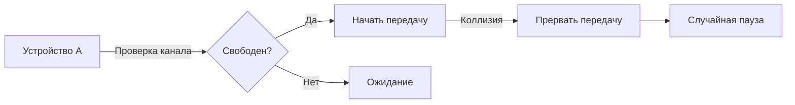

# Локальные сети семейства Ethernet

## Основы канального уровня  
**Канальный протокол** в Ethernet решает задачи управления доступом к среде передачи, адресации устройств и контроля ошибок.  
- **Управление доступом**: Используется алгоритм **CSMA/CD** (Carrier Sense Multiple Access with Collision Detection), позволяющий устройствам "слушать" канал перед передачей и обнаруживать коллизии.  
- **MAC-адресация**: Каждое устройство имеет уникальный 48-битный MAC-адрес (например, `00:AA:00:28:9C:5A`). Широковещательный адрес — `FF:FF:FF:FF:FF:FF`.  
- **Обнаружение ошибок**: Контрольная сумма (CRC) в кадрах Ethernet.  

<Quiz  
  question="Сколько бит в MAC-адресе?"  
  options={["32", "48", "64"]}  
  answer={2}  
/>  

---

## Протокол CSMA/CD  
**Принцип работы**:  
1. Устройство проверяет канал на наличие сигнала
2. Если канал свободен — начинается передача
3. При обнаружении коллизии передача прерывается, и устройство ожидает случайный интервал перед повторной попыткой

<Callout>
  **Домен коллизий** — сегмент сети, где устройства могут "сталкиваться". В современных сетях с коммутаторами коллизии исключены благодаря изоляции трафика.  
</Callout>

---

## Стандарты Ethernet  
Ethernet развивается от медленных коаксиальных сетей до высокоскоростных оптоволоконных решений.  

| Скорость      | Стандарт       | Кабель               | Дальность         |  
|---------------|----------------|----------------------|-------------------|  
| 10 Мбит/с     | 10BASE-T       | Витая пара Cat3      | 100 м             |  
| 100 Мбит/с    | 100BASE-TX     | Витая пара Cat5      | 100 м             |  
| 1 Гбит/с      | 1000BASE-T     | Витая пара Cat5e     | 100 м             |  
| 10 Гбит/с     | 10GBASE-T      | Витая пара Cat6a     | 55 м              |  
| 40 Гбит/с     | 40GBASE-SR4    | Многомодовое волокно | 150 м (OM4)       |  

---

## Оборудование Ethernet  
**Концентратор (Hub)** — передает данные всем устройствам в сети, создавая домен коллизий.  
**Коммутатор (Switch)** — направляет трафик только получателю, используя таблицу MAC-адресов.  

**Алгоритм работы коммутатора**:  
- **Обучение**: Запись MAC-адресов устройств и портов в таблицу коммутации.  
- **Фильтрация**: Передача кадров только через порт получателя.  
- **TTL (Time To Live)**: Автоматическое удаление устаревших записей из таблицы.  

Пример таблицы коммутации:  
| Порт | MAC-адрес         | TTL  |  
|------|-------------------|------|  
| 1    | 00:AA:00:28:9C:5A | 300  |  
| 4    | 00:1C:C4:AB:CD:EF | 120  |  

---

## Эволюция Ethernet  
Современные сети перешли от **CSMA/CD** к управлению через **коммутаторы**, что устранило коллизии и повысило эффективность. Gigabit и 10G Ethernet используют полнодуплексную передачу и оптическое волокно для скоростей до 100 Гбит/с.  

> **Ключевые термины**: MAC-адрес, CSMA/CD, домен коллизий, коммутатор, витая пара, оптоволокно.  