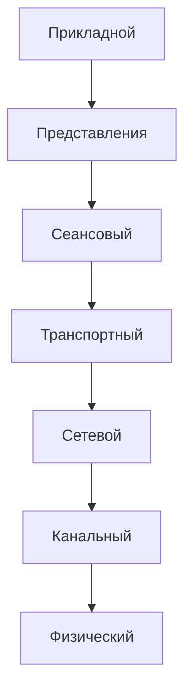

# Сетевой стек и модель OSI

## Введение
Модель OSI (Open Systems Interconnection) — эталонная модель для проектирования и анализа сетевых взаимодействий. Она разделяет процесс передачи данных на 7 уровней, каждый из которых решает определенные задачи.

---

## Проблемы сетевой коммуникации
- **Архитектурные аспекты**:  
  - Взаимодействие разнородных систем (ОС, кодировки, оборудование).  
  - Организационное разделение управления в крупных сетях.  

- **Технические аспекты**:  
  - Задержка (Latency), пропускная способность (Bandwidth), помехи.  
  - Потеря пакетов, угрозы безопасности, проблемы масштабируемости.  

---

## Модель OSI: Уровни и их функции

| Уровень          | Назначение                                                                 | Примеры протоколов               |
|------------------|---------------------------------------------------------------------------|-----------------------------------|
| **Прикладной**   | Интерфейс для взаимодействия приложений (передача файлов, запросы).       | HTTP, FTP, SMTP, DNS             |
| **Представления**| Кодирование, шифрование, сжатие данных.                                   | SSL/TLS, ASCII, Unicode           |
| **Сеансовый**    | Управление сеансами связи (установка, поддержка, завершение).             | RPC                               |
| **Транспортный** | Надежная передача данных, сегментация, управление потоком.                | TCP, UDP                          |
| **Сетевой**      | Маршрутизация, межсетевое взаимодействие, логическая адресация.           | IPv4, IPv6, BGP, ARP              |
| **Канальный**    | Передача кадров между узлами в локальной сети, исправление ошибок.         | Ethernet, Wi-Fi                   |
| **Физический**   | Физическая передача битов (кабели, разъемы, сигналы).                     | IEEE 802.11 (Wi-Fi), RS-232       |

<Quiz  
  question="Какой уровень модели OSI отвечает за маршрутизацию данных между сетями?"  
  options={["Сетевой", "Транспортный", "Канальный"]}  
  answer={1}  
/>

---

## Инкапсуляция и деинкапсуляция

**Инкапсуляция** — добавление заголовков к данным на каждом уровне, начиная с прикладного и до физического.
Пример: `HTTP → TCP → IP → Ethernet`

**Деинкапсуляция** — обратный процесс: удаление заголовков при движении данных от физического уровня к прикладному.

---

## Многоуровневая адресация

На **канальном уровне** применяются MAC-адреса для локальной доставки в пределах одной сети.
На **сетевом уровне** — IP-адреса, необходимые для глобальной маршрутизации.
На **транспортном уровне** — номера портов, чтобы различать приложения на одном устройстве.

**Зачем нужна такая система?**

Локальные адреса (MAC) не требуют глобальной уникальности.
Сетевые адреса (IP) позволяют строить и маршрутизировать сложные иерархии сетей.

---

## Почему важно знать модель OSI?

**Понимание** структуры модели упрощает диагностику и проектирование сетей.
**Стандартизация** позволяет разрабатывать совместимые решения и устройства.
**Терминология** модели — это общий язык для инженеров и разработчиков.

---

> **Ключевые термины**: стек протоколов, инкапсуляция, уровни OSI, MAC-адрес, IP-адрес, порт.