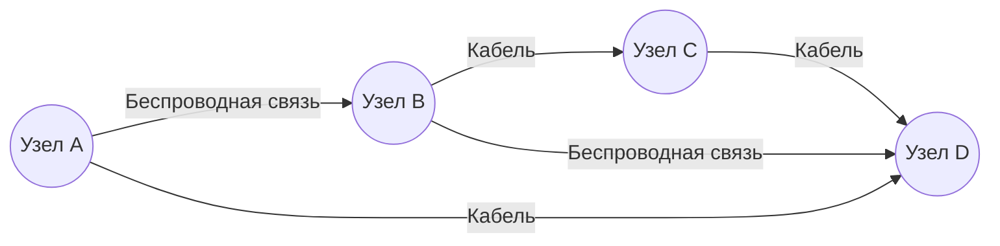
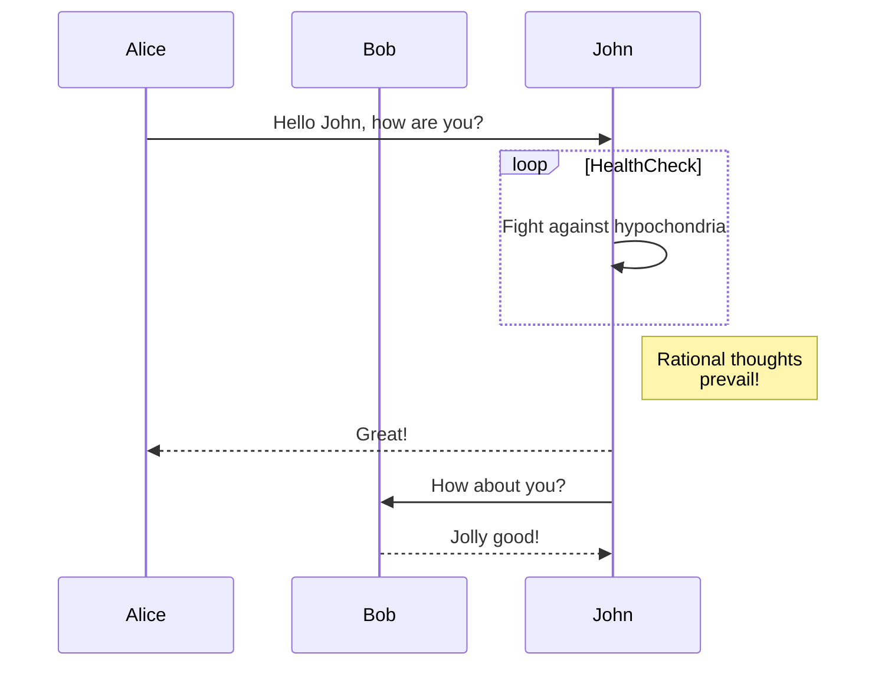
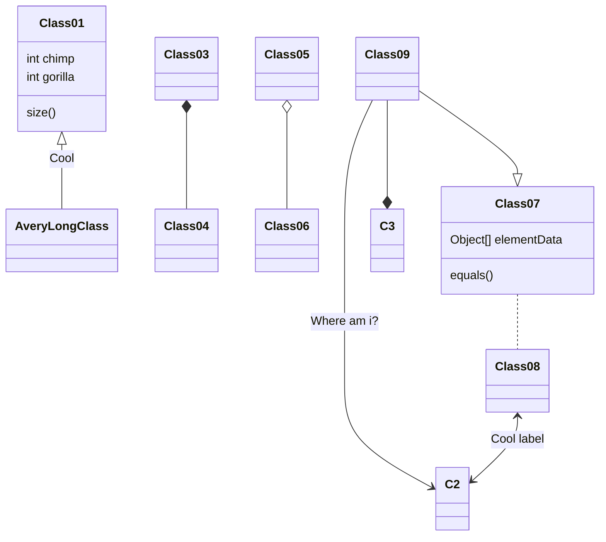
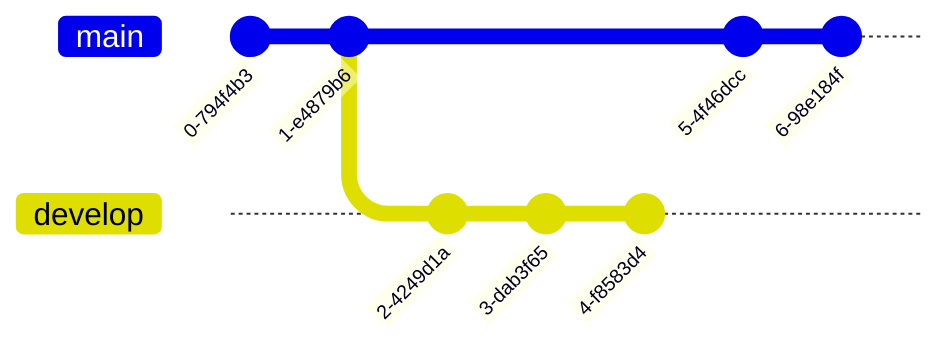
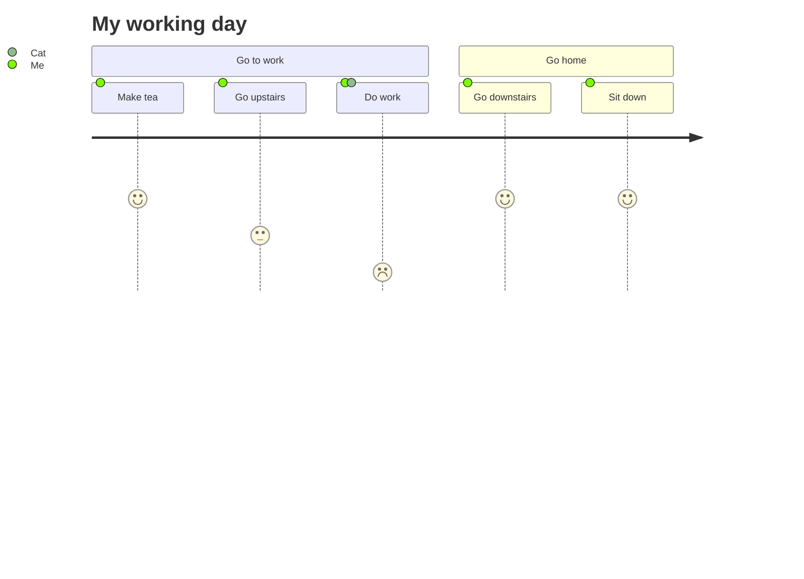

# Типы сетей и топологии

Существует несколько классификаций компьютерных сетей: по размеру, географическому охвату, функциям и другим критериям. В данной главе мы познакомимся с наиболее распространёнными типами сетей, а также с основными топологиями, которые применяются при их построении.

## Основные типы сетей

1. **LAN (Local Area Network)**  
   Локальная сеть, которая обычно охватывает небольшую территорию (офис, дом, кампус).
2. **WAN (Wide Area Network)**  
   Глобальная сеть, охватывающая большие расстояния (города, страны, континенты). Яркий пример — Интернет.
3. **MAN (Metropolitan Area Network)**  
   Городская сеть, охватывающая территорию города или крупного района.
4. **PAN (Personal Area Network)**  
   Личная сеть, созданная вокруг одного пользователя (Bluetooth-устройства, смартфон, ноутбук и т. п.).

  <Image
    src="/images/dashboard-1.jpg"
    width="716"
    height="430"
    alt="Схематическое изображение различных топологий"
    className="mt-6 w-full overflow-hidden rounded-lg border shadow-xs dark:hidden"
  />
  <Image
    src="/images/dashboard-1-dark.jpg"
    width="716"
    height="430"
    alt="Схематическое изображение различных топологий (темная тема)"
    className="mt-6 hidden w-full overflow-hidden rounded-lg border shadow-xs dark:block"
  />
  View network topologies

<Callout className="mt-6">
  При проектировании сети важно учитывать не только тип (LAN, WAN и т. д.), но и
  выбранную топологию, которая определяет, как узлы соединены друг с другом.
</Callout>

## Основные топологии

- **Шинная (Bus)**: Все устройства подключены к одной линии передачи. Легко реализуется, но ограничена по пропускной способности.
- **Кольцевая (Ring)**: Узлы образуют замкнутый контур. Передача данных идет по кольцу. Вывод из строя одного узла может нарушить работу всей сети.
- **Звезда (Star)**: Все устройства подключены к центральному узлу (коммутатор, концентратор). Улучшенная надёжность, легко модернизируется.
- **Смешанная (Mesh)**: Каждый узел может быть связан с несколькими другими, обеспечивая высокую отказоустойчивость.

### Пример смешанной топологии

<Quiz
  question="Какая топология лучше всего подходит для крупных сетей с высокой надёжностью?"
  options={["Шинная (Bus)", "Звезда (Star)", "Смешанная (Mesh)"]}
  answer={3}
/>

