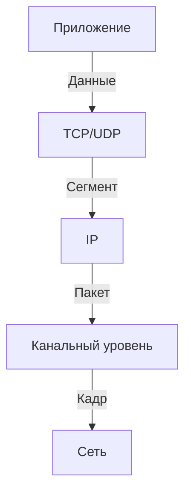

# Архитектура стека TCP/IP

## Общая характеристика  
**TCP/IP** — открытый сетевой стек, обеспечивающий связь между разнородными системами. Основные протоколы:  
- **TCP** (Transmission Control Protocol) — гарантирует надежную доставку данных.  
- **IP** (Internet Protocol) — отвечает за маршрутизацию и адресацию.  

Стек делится на **4 уровня**:  
1. **Прикладной** (HTTP, FTP, DNS).  
2. **Транспортный** (TCP, UDP).  
3. **Сетевой** (IP, ICMP).  
4. **Канальный** (Ethernet, Wi-Fi).  

---

## История создания  
- **1969**: Начало разработки ARPANET.  
- **1983**: Переход ARPANET на TCP/IP.  
- **1992**: Появление `WWW`.  
- **2019**: Стандарт Wi-Fi 6 (802.11ax).  

Ключевые этапы:  

---

## Поток данных через стек  
Данные проходят через уровни, обрастая заголовками:  

**Инкапсуляция**:  
- HTTP → TCP → IP → Ethernet.  
- Каждый уровень добавляет свой заголовок (например, IP-адрес, порт).  

---

## Адресация  

### IPv4  
- **Формат**: 4 октета (например, `192.168.1.1`).  
- **Маска подсети**: Определяет границы сети (`255.255.255.0` или `/24`).  
- **CIDR**: Бесклассовая адресация (например, `10.0.0.0/16`).  

| Тип адреса       | Пример           | Назначение               |  
|-------------------|-------------------|--------------------------|  
| **Unicast**       | `192.168.1.5`    | Один получатель          |  
| **Broadcast**     | `192.168.1.255`  | Все узлы в сети          |  
| **Multicast**     | `224.0.0.1`      | Группа узлов             |  

### IPv6  
- **Формат**: 128 бит (например, `2001:0db8:85a3::8a2e:0370:7334`).  
- **Типы адресов**:  
  - **Global Unicast**: `2001:db8::/32` (публичные).  
  - **Link-local**: `fe80::/10` (локальная связь).  
  - **Multicast**: `ff02::1` (все узлы).  

---

## Типы рассылок  
- **Unicast**: Отправка одному узлу (например, веб-страница).  
- **Broadcast**: Отправка всем в сети (например, ARP-запрос).  
- **Multicast**: Отправка группе (например, видеостриминг).  
- **Anycast**: Отправка ближайшему узлу в группе (например, CDN).  

---

## Организация разработки  
- **RFC (Request for Comments)**: Документы, определяющие стандарты (например, RFC 791 для IP).  
- **IETF (Internet Engineering Task Force)**: Разрабатывает и обновляет протоколы.  

> **Пример RFC**:  
> RFC 1918: Частные IPv4-адреса (10.0.0.0/8, 172.16.0.0/12, 192.168.0.0/16).  

---

## Ключевые особенности  
- **Платформонезависимость**: Работает на любых ОС и устройствах.  
- **Гибкость**: Поддерживает разнообразные физические среды (Ethernet, Wi-Fi, оптоволокно).  
- **Масштабируемость**: От локальных сетей до глобального Интернета.  

> **Термины**: CIDR, инкапсуляция, сокет, RFC, Anycast.  