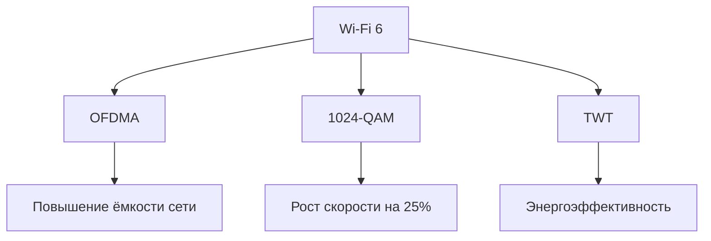

# Беспроводные сети на примере Wi-Fi

## История и развитие  
Wi-Fi появился в 1991 году как решение для кассовых систем. Создатель **Вик Хейз** участвовал в разработке ключевых стандартов:  
- **802.11b/a/g** (1999–2003): скорости до 54 Мбит/с.  
- **802.11n (Wi-Fi 4)** (2009): внедрение MIMO и скорости до 600 Мбит/с.  
- **802.11ax (Wi-Fi 6)** (2019): поддержка OFDMA и скоростей до 10 Гбит/с.  

---

## Проблемы радиоканалов  
Беспроводная связь сталкивается с уникальными вызовами:  

- **Затухание сигнала:** Ослабление мощности из-за расстояния, препятствий или поглощения средой.
- **Многолучевость:** Сигнал достигает приёмника по нескольким путям, вызывая интерференцию.
- **Широковещательные помехи:** Перекрытие каналов в плотных сетях (например, в офисах).

---

## Стандарты Wi-Fi  
### Сравнение ключевых версий  
| Стандарт    | Год     | Частота      | Макс. скорость | Технологии                          |  
|-------------|---------|--------------|----------------|-------------------------------------|  
| **Wi-Fi 4** | 2008    | 2.4/5 ГГц    | 600 Мбит/с     | MIMO (4x4), 40 МГц каналы           |  
| **Wi-Fi 5** | 2014    | 5 ГГц        | 6.9 Гбит/с     | MU-MIMO, 160 МГц каналы             |  
| **Wi-Fi 6** | 2019    | 2.4/5/6 ГГц  | 10 Гбит/с      | OFDMA, 1024-QAM, BSS Coloring       |  

---

## Технологии передачи  

### OFDM и OFDMA  
**OFDM**: Делит канал на поднесущие для параллельной передачи.  
  ```mermaid  
  graph LR  
      A[Данные] --> B{Разделение на поднесущие}  
      B --> C[Передача]  
      C --> D[Сборка на приёмнике]  
  ```  
**OFDMA (Wi-Fi 6)**: Позволяет передавать данные нескольким пользователям одновременно на одном канале.  

### MIMO и Beamforming  
**MIMO**: Использует несколько антенн для увеличения пропускной способности.  
  Пример: **4x4:4** — 4 антенны на передачу, 4 на приём, 4 потока данных.  

**Beamforming**: Формирует направленный сигнал к клиенту, усиливая связь.  

---

## Оборудование и режимы работы  

### Типы устройств  
- **Точка доступа (AP)**: Обеспечивает подключение клиентов к сети.  
- **Wi-Fi роутер**: Комбинирует AP, маршрутизатор и коммутатор.  
- **Мост (Bridge)**: Соединяет две сети по беспроводному каналу.  

### Режимы:  
- **Ad-Hoc**: Прямое соединение между устройствами без AP.  
- **WDS**: Создание распределённых сетей (например, точка-многоточка).  

---

## Безопасность  
Эволюция методов защиты:  
1. **WEP** (уязвим из-за слабого шифрования).  
2. **WPA/WPA2**: Используют TKIP и AES. WPA2 обязателен с 2006 года.  
3. **WPA3** (2018): Усиленное шифрование (SAE) и защита от перехвата.  

<Callout>
**Важно!** Для корпоративных сетей рекомендуется **802.1X** с аутентификацией через RADIUS-сервер.
</Callout>

---

## Wi-Fi 6: Что нового?  
- **OFDMA**: Эффективное использование канала для множества устройств.  
- **1024-QAM**: Увеличивает плотность данных в сигнале.  
- **TWT (Target Wake Time)**: Снижает энергопотребление IoT-устройств.  



--- 

> **Ключевые термины**: MIMO, OFDMA, Beamforming, WPA3, BSS Coloring.  